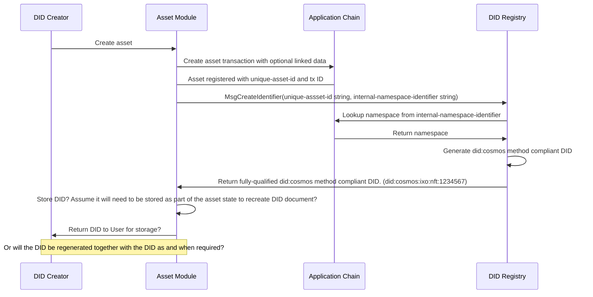
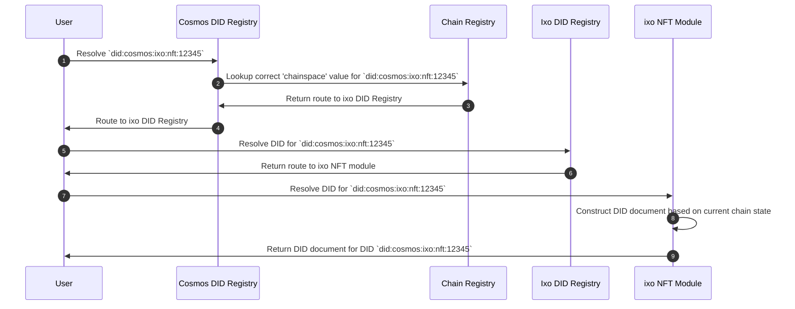
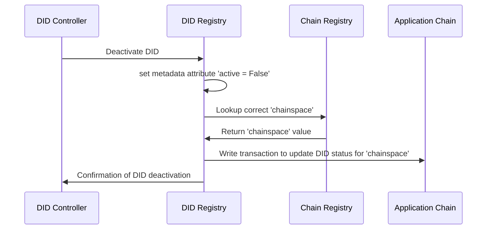

# did:cosmos Method Specification
This document defines the syntax, data model, and operations for the **did:cosmos** DID method.

**Authors** : 
* **Joe Andrieu** &lt;<a href="mailto:joe@legreq.com">joe@legreq.com</a>&gt;
* **Lohan Spies** &lt;<a href="mailto:lohan.spies@ixo.world">lohan.spies@ixo.world</a>&gt;
* **Shaun Conway** &lt;<a href="mailto:shaun.conway@ixo.world">shaun.conway@ixo.world</a>&gt;

This specification is under active development at https://github.com/EarthProgram/did-cosmos .
## Abstract
**did:cosmos** is an IID method designed to refer to Cosmos-compatible on-chain assets.

Interchain Identifiers (IIDs) [[1]](#ref1) are a family of Decentralized Identifier methods which are purpose-designed to identify, refer to, and interact with digital assets within blockchain namespaces.

The IID specification builds on the Decentralized Identifier (DID) Core specification from the World Wide Web Consortium (W3C) [[2]](#ref2). IIDs are fully conformant DIDs and therefore are DIDs. IID Documents are DID documents. Unlike DIDs, IIDs only reference on-chain assets—which we will refer to as tokens—but should be taken as any type of tokens, such as NFTs, fungible tokens, tokenized namespace records, or other on-chain assets.

Restricted to on-chain assets, IIDs are a new class of identifier uniquely suited to the requirements of fungible tokens, non-fungible tokens, and other chain-native components. IID methods can be developed for any compatible blockchain, making them suitable for interoperable representations of assets (and the cryptography that secures those tokens) regardless of the underlying chain.

This particular specification, **did:cosmos** applies the IID approach to assets on blockchains made with the Cosmos SDK.

IIDs also introduce a few new features—conformant extensions to the DID Core specification—that provide for privacy-respecting options for the full range of expected token functionality, including Linked Resources, On-chain Service Endpoints, and Accorded Rights. We describe those here, capturing their definition at the time this specification was developed. See the IID specification for current normative definitions.

DID Methods which conform to the IID specification resolve to a DID document representing how to securely interact with a uniquely identified digital asset, within a unique blockchain namespace. Because IIDs are DIDs, software applications that are conformant with the W3C specification will be able to inter-operate with IIDs and IID documents, although some IID-specific features may require additional tooling.

**did:cosmos** DIDs are IIDs intended identify assets on Cosmos application chains.

## Architecture Overview
In the Cosmos ecosystem, **application chains** are sovereign blockchains built using the Cosmos SDK. These application chains are comprised of various modules, which perform different functions. We refer to modules that manage the state of on-chain assets as **asset modules**.

To support **did:cosmos**, three modules must be operational: a **chain registry**, a **namespace registry**, and an **asset module**.

<!--```mermaid
classDiagram
    class ChainRegistry
    ChainRegistry : -chainDescriptors
    ChainRegistry : +getChainDescriptor(chainspace)
    ChainRegistry : +setChainDescriptor(chainDescriptor)

    class NamespaceRegistry
    NamespaceRegistry : -namespaceDescriptors
    NamespaceRegistry : +getNamespaceDescriptor(namespace)
    NamespaceRegistry :+setNamespaceDescriptor(namespaceDescriptor)

    class AssetModule
    AssetModule : -assets
    AssetModule : +getDidDocument(DID)
    AssetModule : +createAsset(assetDescriptor)
    AssetModule : updateAsset(assetDescriptor)
    AssetModule : deactiveAsset(DID)
```
-->
**Chain Registry** Maintains a set of chain descriptors which describe how to access particular application chains, indexed by chainspace.

**Namespace Registry** Maintains a set of namespace descriptors which describe how to access particular asset modules, indexed by namespace.

**Asset Module** Maintains on-chain assets, with its own module-specific functions for creating, updating, and deactivating assets. Each Asset Module MUST also support a method for retrieving the DID Document for a given asset, given a DID managed by that module.

The role of each of these modules is further described below.
## did:cosmos Syntax
An example `did:cosmos` method identifier is `did:cosmos:version:chainspace:namespace:unique-id`.

There are four forms of did:cosmos DIDs

```abnf
did:cosmos:version:chainspace:namespace:unique-id
did:cosmos:chainspace:namespace:unique-id
did:cosmos:version:chainspace
did:cosmos:chainspace
```

In short, you must have a chainspace, but the version and asset-id are optional.

### did:cosmos DID Syntax (ABNF)

```abnf
did-cosmos          = "did:cosmos:" method-specific-id
method-specific-id = [version ":"] chainspace [":" asset-id]
version            = 1*DIGIT
chainspace         = ALPHA *id-char
asset-id           = namespace ":" unique-id
namespace          = *id-char
unique-id          = *( *idchar ":" ) 1*id-char
id-char             = ALPHA / DIGIT / "." / "-" / "_" / pct-encoded
pct-encoded        = "%" HEXDIG HEXDIG
```

### Method Name
A DID that uses this method MUST begin with the prefix `did:cosmos`. The prefix string MUST be in lowercase.

### Method Specific Identifier
The `did:cosmos` method-specific identifier (`method-specific-id`) is made up of a `version`, `chainspace` and a `asset-id` component.

The `version`, if present, MUST be an integer that identifies a specific version of `did:cosmos` method operations such as
create, read, update, and deactivate. The version number increases by one for each breaking change in the specification, enabling future enhancements to the specification while retaining backwards compatibility for long-lived identifiers.

If `version` is not present, it MUST be assumed to be version 1, the set of operations defined in this initial version of the specification. Later versions will refer to operations defined in a future version of this specification. Note that the version refers to the set of operations, not the version of the specification.

Implementers SHOULD maintain compatibility with all existing versions likely to be in use. For application chains that identify assets using did:cosmos, this means supporting the version that was current when the chain first adopted did:cosmos functionality, as well as all subsequent versions if possible. DID resolvers--which may be off-chain--will likely need to maintain support for all versions until convinced there are no outstanding DIDs using that version. Software which is asked to handled a version # that it does not support MUST return an error.

The `chainspace` is defined as a string that identifies a specific Cosmos blockchain (e.g. "ixo", "regen", "cosmos") where the DID reference is stored. It must begin with an alphabetic character so parsers can distinguish between the `version` component and the `chainspace` component. Thereafter, it may contain any alpha numeric character.

The `asset-id`, if present, MUST be a unique identifier for the particular on-chain asset hosted on the blockchain defined by `chainspace`. It is comprised of a `namespace` and a `unique-id`.

The `namespace` is an alphanumeric string that identifies a distinct namespace managed by the application chain's name server module. These namespaces, e.g., "nft", "bank", "staking", identify where the on-chain asset is maintained on that particular chain. It is used to route incoming resolution requests to the correct asset module.

The `unique-id` is mixed character string that uniquely identifies an asset managed by the application chain under the namespace defined by the `namespace` component. The asset module that handles each namespace MUST enforce uniqueness so that one and onely one asset under that module's control is associated with each `unique-id`. To facilitate off-chain creation of did:cosmos DIDs, prior to creating an on-chain asset, the `unique-id` MUST be a representation of a Secp256k1 public key as encoded for did:key <https://w3c-ccg.github.io/did-method-key/#secp256k1> based on the multibase and multicodec methods: ```multibase(multicodec(public_key))

If `asset-id` is missing, then the DID refers to the chainDescriptor maintained by the chain registry rather than an asset maintained by an asset module.

For example, `did:cosmos:ixo` refers to the chain descriptor associated with the "ixo" chain space in the chain registry.

### did:cosmos DID-URL syntax
**did:cosmos** DIDs may also be used in DID-URLs, based on [RFC5234](https://www.w3.org/TR/did-core/#bib-rfc3986)
```abnf
cosmos-did-url      = cosmos-did [path-abempty] [ "#" fragment ]
path-abempty  = *( "/" segment )
segment       = *pchar
segment-nz    = 1*pchar
segment-nz-nc = 1*( unreserved / pct-encoded / sub-delims / "@" )
pchar         = unreserved / pct-encoded / sub-delims / ":" / "@"
fragment    = *( pchar / "/" / "?" )
```
NOTE: **did:cosmos** does not support `query` parts. The path and fragment parts are defined below.
## Adding support for did:cosmos

To support `did:cosmos`, any Cosmos application chain MUST add an entry in the Cosmos Chain Registry [[3]](#ref3). Each network, such as "mainnet" or "testnet" are independent entries in the registry with unique chain names and separate chain definition files, called`chain.json`. Each `chain.json` MUST provide all of the information required for connecting to that network. The `chain_name` MUST be used to as the `chainspace` string in the `did:cosmos` method. The `chain-id` contained in the `chain.json` will be used to identify the correct Cosmos blockchain network to connect to.

The Cosmos Chain Registry is the source of valid `chainspace` values and can be programmatically queried via an API [[4]](#ref4).

For each Cosmos blockchain there MUST be an entry in the [Cosmos Chain Registry](https://github.com/cosmos/chain-registry) that includes a file called `chain.json`. The chain registry's chain descriptors will point to the appropriate source for its chain.json file.

The `did:cosmos` method supports offline creation of DIDs. Any valid Secp256k1 public key may be used to identify a did:cosmos asset. To support this, each asset module must allow the assignment of an assetID at creation. It SHOULD use a message format that includes a signature using the associated private key to establish the initial control over that key. If an asset module is called to create an asset with an asset-id already associated with an asset under its control, it MUST be rejected.

During resolution, resolvers MUST first check on-chain to see if a given identifier is registered with the asset module. If that returns an "identifier not found" error, it must generate a minimalist deterministic DID document using the algorithm defined for did:key, but retaining the full did:cosmos DID as its identifier.

Note that to support this functionality, the chain registry--which is itself an asset module managing the chainspace descriptors--exposes two functions which refer to the same asset:

* getDidDocument(`did:cosmos:hub:chainregistry:abc123`) -- returns the DID document for controlling that chain descriptor.
* getChainDescriptor(`did:cosmos:ixo`) -- returns the chain descriptor file associated with the "ixo" chainspace.

### Examples of `did:cosmos` identifiers

A DID written to the ixo Impact Hub Cosmos Blockchain network "NFT" `namespace`:

```abnf
did:cosmos:1:ixo:nft:7Tqg6BwSSWapxgUDm9KKgg
```

A DID written to the Regen Cosmos Blockchain network "NFT" `namespace`:

```abnf
did:cosmos:1:regen:ecocredit:1Kpg3KJPOIarthPWf8HHyy
```

A DID written to the Regen `Testnet` Cosmos Blockchain network "NFT" `namespace`:

```abnf
did:cosmos:1:regentest:ecocredit:1Kpg3KJPOIarthPWf8HHyy
```

A DID URL on the ixo Impact Hub Cosmos Blockchain network "NFT" `namespace` for retrieving a specific IID Linked Resource using a `path`:

```abnf
did:cosmos:1:ixo:nft:7Tqg6BwSSWapxgUDm9KKgg/myresource
```

A DID written to the ixo Cosmos Blockchain network "NFT" `namespace` referencing a specific IID Linked Resource `fragment`:

```abnf
did:cosmos:1:ixo:nft:7Tqg6BwSSWapxgUDm9KKgg#myresource
```

## DID documents
A DID document associated with a **did:cosmos** DID is a set of data describing an on-chain asset. The representation of a **did:cosmos** DID document MUST meet the DID Core specifications [[5]](#ref5).

### Properties defined for all W3C specification compliant DID documents 

1. **`@context`** (mandatory): The serialized value of @context MUST be the JSON String https://www.w3.org/ns/did/v1, or a JSON Array where the first item is the JSON String https://www.w3.org/ns/did/v1 and the subsequent items are serialized according to the JSON representation production rules. (This also requires the IID context, described in the following section.)
2. **`id`**: A **did:cosmos** DID as defined in this document. 
3. **`controller`** (optional): A list of fully qualified DID strings or one string. Contains one or more DIDs whose verification relationships MUST be considered valid for this DID.
4. **`verificationMethod`** (optional): A list of Verification Methods
5. **`authentication`** (optional): A list of strings with key aliases or IDs
6. **`assertionMethod`** (optional): A list of strings with key aliases or IDs
7. **`capabilityInvocation`** (optional): A list of strings with key aliases or IDs
8. **`capabilityDelegation`** (optional): A list of strings with key aliases or IDs
9. **`keyAgreement`** (optional): A list of strings with key aliases or IDs
10. **`service`** (optional): A set of Service Endpoint maps
11. **`alsoKnownAs`** (optional): A list of strings. A DID subject can have multiple identifiers for different purposes, or at different times. The assertion that two or more DIDs refer to the same DID subject can be made using the `alsoKnownAs` property.

### Verification method

Verification methods are used to define how to authenticate / authorise interactions with a DID subject or delegates. Verification method is an OPTIONAL property.

1. **`id`** (string): A string with format `did:cosmos:impacthub:<chainspace>:<namespace>#<key-alias>`
2. **`controller`**: A string with fully qualified DID. DID must exist.
3. **`type`** (string)
4. **`publicKeyJwk`** (`map[string,string]`, optional): A map representing a JSON Web Key that conforms to RFC7517 [[7]](#ref7). See definition of `publicKeyJwk` for additional constraints.
5. **`publicKeyMultibase`** (optional): A base58-encoded string that conforms to a MULTIBASE [[8]](#ref8)
encoded public key.

**Note**: Verification method cannot contain both `publicKeyJwk` and `publicKeyMultibase` but must contain at least one of them.

##### Example of Verification method in a DID document

```jsonc
{
  "id": "did:cosmos:1:impacthub:nft:abc123#key-0",
  "type": "JsonWebKey2020",
  "controller": "did:cosmos:1:impacthub:nft:abc123",
  "publicKeyJwk": {
    "kty": "OKP",
    // external (property name)
    "crv": "Ed25519",
    // external (property name)
    "x": "VCpo2LMLhn6iWku8MKvSLg2ZAoC-nlOyPVQaO3FxVeQ"
    // external (property name)
  }
}
```

### Service

Services can be defined in a DID document to express means of communicating with the DID subject or associated entities.

1. **`id`** (string): The value of the `id` property for a Service MUST be a URI conforming to RFC3986 [[9]](#ref9). A conforming producer MUST NOT produce multiple service entries with the same ID. A conforming consumer MUST produce an error if it detects multiple service entries with the same ID. It has a follow formats: `<did-document-id>#<service-alias>` or `#<service-alias>`.
2. **`type`** (string): The service type and its associated properties SHOULD be registered in the DID Specification Registries [[10]](#ref10)
3. **`serviceEndpoint`** (strings): A string that conforms to the rules of RFC3986 [[9]](#ref9) for URIs, a map, or a set composed of a one or more strings that conform to the rules of
RFC3986 for URIs and/or maps.


### Additional Properties

In addition to the properties defined in DID Core, the following properties are defined for **did:cosmos**.

#### Context
As an IID, **did:cosmos** DID documents MUST include `https://earthprogram.github.io/NS/iid/v1` as a context value, following the default DID context:

```json
"@context" : [
   "https://www.w3.org/ns/did/v1",
   "https://w3id.org/earth/NS/iid/v1"
]
```

#### Linked Resources

`linkedResource` (optional) : property provides a privacy-enabled way to attach digital resources to an on-chain asset. This is an optional property which may contain one or more resource descriptors in an array. This property provides the metadata required for accessing and using the specified resource, such as the type of resource, a proof to verify the resource, and a service endpoint for requesting and retrieving the resource.

Resources may be provided in-line or by secure reference. Inline resources are appropriate only for use cases that need to directly include the resource in the IID Document. In many cases, this is a privacy problem. However, for some use cases, resources must be specified for on-chain execution, which justifies the added bytes and potential disclosure risk. The resource descriptor provides for a flexible representation of various mime types, compression, and encoding, as required for the use.

Resources may be secured by specifying a `proofType` of hash or hashgraph. A hashgraph uses a merkle tree of hashes for external content associated with this asset. A resource descriptor of this type obscures both the type and the number of such resources, while allowing each such resource to be verifiably linked to the asset. It also provides for privacy-respecting verification of complete disclosure. Anyone who needs to prove they have all of the linked resources can compare their own hash graph of resources with the value stored in the IID Document. Note this anti-censorship technique requires a verifier to discover the type and nature of those resources on their own.

Proposed properties for resource descriptors in the `LinkedResource` property:

```javascript
{
 "linkedResource": [{

  "path"(optional): // IID Resource path for this resource in the asset namespace, e.g., /myResource.png

   "id"(optional): // IID Reference ID for this resource, e.g., #myResource.png

   "rel"(optional): // the relationship of this resource to the IID Asset

   "type": "nft:ResourceDescriptor", // The JSON-LD type of this resource

  "proof": [ // an array of proofs, any of which may be used
   {
    "type"(optional): "hash" | "hashgraph" | "hashset" // the form of proof used to verify the resource as authentic
    "stage"(optional): "raw" | "compressed" | "encrypted" | "encoded" // the 
    "value"(optional): hash | hashgraph | hashset, // the actual proof for this particular resource
   }
  ],
  "resourceFormat": media type, // the IANA media-type of the linked resource

  "compression"(optional): "gzip" | "none", // the compression (performed on the raw resource) of an inline resource

  "encryption": [open ended
   for arbitrary extensibility
  ], // the encryption technique applied after compression and before encoding

  "encoding"(optional): "native" | "multibase" | "string", // the encoding (after compression and encryption) of an inline resource; "native" means the inline resource is native JSON-LD with neither compression nor encryption

  "endpoint"(optional): url, // a URL at which this resource can be retrieved before decrypting and decrompressing

  "resource"(optional): "..."
  a representation of the resource
  for inline
  distribution,
  encoded as per "encoding"
    }]
}
```
#### Transcludes
**`transclude`** (optional): is a new IID document property for specifying where in an IID document to transclude a linked resource. If present, the value of this property MUST be one (or an array of more than one) Linked Resources that eventually dereferences to a raw JSON-LD object. The properties of that JSON-LD object will be injected into the current IID document, replacing the transclude property entirely. The properties of the transcluded JSON-LD MUST be transformed to their absolute representation using the object's `@context` value prior to transclusion. The associated linked resources MUST have a `rel` value of "extension" and a `mediaType` value of "application/ld-json"
#### Extension
**`extension`** (optional): a type of Linked Resource. A JSON-LD extension of the current document. The RDF statements in the extension are to be included in the current IID document, where specified by a "transclude" property. For example, additional service endpoint definitions may be added in a linked resource. These endpoints can be verified as being associated with the IID. But only by those parties who secure the definitions through other privacy respecting mechanisms. This property standardizes how to verifiably move arbitrary RDF statements outside of the IID document context, to provide additional security and privacy.
#### Executable Rights
**`executableRight`** (optional): a type of Linked Resource. This resource is a machine-executable capability that can be invoked by the IID owner or its delegate, using cryptographic materials defined elsewhere in the IID document Verification Methods property.
#### Assertion
17. **`assertion`** (optional): a rel value for a Linked Resource. Verifiable credentials, verified claims, claim tokens as described in NFT-RFC-008 [[6]](#ref6). This allows arbitrary, yet verifiable attestations to be made either about the asset or about the resources defined by IID references. The attributes represented in these claims can be retrieved through the token interface using a Query by Example. (graph query) mechanism.
#### Real
**`rel`** (optional): a property of Linked Resource. Defines the relationship of this resource to the IID asset. Known values include:
     1. "evidence" -- The resource is evidence for the creation of the asset.
     2. "encodedRepresentation" -- The resource is a binary representation of the asset, interpretable by compatible software to display or interact with.
     3. "visualRepresentation" -- The resource is a visual representation of the asset
#### Accorded Rights
**`accordedRight`** (optional): a type of relationship to a Linked Resource. Specifies the rights accorded to the IID owner, or its deligate, which may be executed by physical-world institutions or processes. Such as a digital driver's license according certain rights to drive, or a theater ticket according access to a show. The representation framework for such rights must be non-prescriptive, including both plain text statements of rights, e.g., "The controller of this IID is entitled to ...", or more rigorous and computationally evaluatable RDF statements, which might describe in great detail a range of benefits that accompany the basic rights of the token.
#### Display Name
 **`displayName`** (optional): a property of Linked Resources that provide a brief textual label for display.
#### Display Description
**`displayDescription`** (optional): a property of Linked Resources that provide a longer text phrase for displaying additional detail about the asset.
#### Display Icon
**`displayIcon`** (optional): a property of Linked Resources that provide a URL for an image asset to use when displaying the asset.

#### State format for DID documents on ledger

**Consider the following example minimum DID document from DID Core:**
#### EXAMPLE 1: A minimal DID document (JSON-LD)
(not a did:cosmos did document, shown for comparison)

```json
{

"@context": "https://www.w3.org/ns/did/v1",

"id": "did:example:abc123",

"authentication": [{

  "id": "did:example:abc123#keys-1",

  "type": "Ed25519VerificationKey2020",

  "controller": "did:example:abc123",

  "publicKeyMultibase": "zH3C2AVvLMv6gmMNam3uVAjZpfkcJCwDwnZn6z3wXmqPV"

  }]

}
```

This minimal DID document is fully conformant with the specification and includes a single verification relationship and method: how to
authenticate on behalf of the DID Subject.

It is useful to note that Verification Methods can be anything\*, e.g., ed25519, secp256k, etc.

**An equivalent example of minimal IID document would be:**

#### EXAMPLE 2: A minimal IID document (JSON-LD)

```json
{

"@context" : [
   "https://www.w3.org/ns/did/v1",
   "https://w3id.org/earth/NS/iid/v1"
],
"id": "did::cosmos:1:impacthub:nft:abc123",

"authentication": [{

  "id": "did:cosmos:1:impacthub:nft:abc123i#keys-1",

  "type": "Ed25519VerificationKey2020",

  "controller": "did:cosmos:1:impacthub:nft:abc123",

  "publicKeyMultibase": "zH3C2AVvLMv6gmMNam3uVAjZpfkcJCwDwnZn6z3wXmqPV"

  }]

}
```

#### EXAMPLE 3: A minimal, privacy-preserving IID document (JSON-LD)

```json
{

  "@context" : [
   "https://www.w3.org/ns/did/v1",
   "https://w3id.org/earth/NS/iid/v1"
  ],


  "id": "did:cosmos:1:impacthub:nft:abc123",

  "authentication": [{

    "id": "did::cosmos:1:impacthub:nft:abc123i#keys-1",

    "type": "Ed25519VerificationKey2020",

    "controller": "did:cosmos:1:impacthub:nft:abc123",

    "publicKeyMultibase": "zH3C2AVvLMv6gmMNam3uVAjZpfkcJCwDwnZn6z3wXmqPV"

  }],

  "service": [{

    "id":"did:cosmos:1:impacthub:nft:abc123#mediator",

    "type": "polymorphicMediator2021",

    "serviceEndpoint": "http://8zd335ae47dp89pd.onion/iid/mediator/ did:example:abc123"

  }],

"linkedResource" : [{

    "id": "did:cosmos:1:impacthub:abc123#resourceHashgraph",

    "path": "did:cosmos:1:impacthub:nft:abc123/resourceHashgraph",

    "type": "hashgraph",
  
    "proof": "afybeiemxf5abjwjbikoz4mcb3a3dla6ual3jsgpdr4cjr3oz",

    "endpoint" : "did:cosmos:1:impacthub:nft:abc123?service=mediator"

  }]

}
```

#### EXAMPLE 4: A privacy-preserving IID document with zCap support (JSON-LD)
```json
{

  "@context": [
    "https://www.w3.org/ns/did/v1",
    "https://www.w3id.org/earth/NS/iid/v1"
  ],
  "id": "did:cosmos:1:impacthub:nft:abc123",

  "verificationMethod": [{
    "id": "did:cosmos:1:impacthub:nft:abc123#keys-1",
    "type": "Ed25519VerificationKey2020",
    "controller": "did:cosmos:1:impacthub:nft:abc123",
    "publicKeyMultibase": "zH3C2AVvLMv6gmMNam3uVAjZpfkcJCwDwnZn6z3wXmqPV"
  }],

  "authentication": "did:cosmos:1:impacthub:nft:abc123#keys-1",
  "capabilityDelegation" : "did:cosmos:1:impacthub:nft:abc123#keys-1",
  "capabilityInvocation" : "did:cosmos:1:impacthub:nft:abc123#keys-1",

  "service": [{
    "id":"did:cosmos:1:impacthub:nft:abc123#mediator",
    "type": "polymorphicMediator2021",
    "serviceEndpoint": "http://8zd335ae47dp89pd.onion/iid/mediator/did:cosmos:1:impacthub:nft:abc123"
  }],

"linkedResource" : [{
    "id": "did:cosmos:1:impacthub:nft:abc123#resourceHashgraph",
    "path": "did:cosmos:1:impacthub:nft:abc123/resourceHashgraph",
    "type": "hashgraph",
    "rel":"attachments",
    "proof": "afybeiemxf5abjwjbikoz4mcb3a3dla6ual3jsgpdr4cjr3oz",
    "endpoint" : "did:cosmos:1:impacthub:nft:abc123?service=mediator"
  }]

}
```


### JSON-LD

All did:cosmos serializations MUST use json-ld.
<https://w3c.github.io/did-core/#json-ld>

The DID document, DID document data structures, and representation-specific entries map MUST be serialized to the JSON-LD representation according to the JSON representation production rules as defined in § 6.2 JSON.

In addition to using the JSON representation production rules, JSON-LD production MUST include the representation-specific @context entry. The serialized value of @context MUST be a JSON Array where the first item is the JSON String `https://www.w3.org/ns/did/v1`, and the second item is the JSON string `https://www.w3id.org/earth/NS/iid/v1`.

#### Example of Service in a DID document

```jsonc
{
  "id":"did:cosmos:1:impacthub:nft:abc123#linked-domain",
  "type": "LinkedDomains",
  "serviceEndpoint": "https://bar.example.com"
}
```

## DID operations
DID and DID  documents are managed by a Cosmos-SDK module that uses the gRPC communication protocol. See the draft method specification [[11]](#ref11) for details on how create, read, update and delete (CRUD) operations are handled in the Cosmos IID module.

### Create DID (Register)


The objective of the IID method is to allow any application developer to include the `did:cosmos` method in Cosmos modules. Most modules (e.g. NFT, bank, tx) already keep state and events related to assets created and managed by the module. IIDs can be created by any module as an additional capability to enrich assets and related information that exist on-chain and off-chain.

Any developer is free to implement the 'did:cosmos' method as a DID and on-chain asset enrichment capability inside any Cosmos module.
DID records created by various Cosmos module developers will be stored in an internal DID registry of the module as part of the module state. DID records can change state from trigger events by the linked asset.

Below is an example of create operation with the IID interface used by did:cosmos.

This operation creates a new DID using the did:cosmos method along with associated DID document representation.

To create and publish a local `chainspace` DID document use the message: 

```golang
MsgCreateIdentifier(unique-id string, namespace string)
```
To create and publish a remote `chainspace` DID document use the message: 

```golang
MsgCreateIdentifier(unique-id string, namespace string, chainspace string)
```

If the input DID is not a valid DID for the **did:cosmos** method, or if the DID already exists on-chain, the message returns an error.

- **`unique-id`**: `MsgCreateIdentifier` unique asset ID inside a Cosmos module.
- **`namespace`**: the relevant module that control the associated DID on-chain asset.
- **`chainspace`**: the relevant Cosmos blockchain that the DID should be registered on.
- **`controller, verificationMethod, authentication, assertionMethod, capabilityInvocation, capabilityDelegation, keyAgreement, service, alsoKnownAs, context`**: Optional parameters in accordance with DID Core specification properties.

#### Client request format for create DID
```jsonc
WriteRequest (MsgCreateIdentifier(unique-id string, namespace string)
```

#### Example of a create DID client request
```jsonc
WriteRequest{
        "data": MsgCreateIdentifier {
                "id": "1234567",
                "namespace": "nft"
            }
}
```

### Read DID (Resolve and Verify)
Example flow for `did:cosmos:ixo:nft:12345`, an asset hosted by the NFT module on the ixo application chain.


To resolve did:cosmos method DID documents, the `QueryIdentifierDocument` operation fetches a response from the ledger. The integrity of the DID documents stored on the ledger is guaranteed by the underlying Cosmos blockchain protocol. DID resolution requests can be sent to the gRPC IID resolver interface for a node by passing the fully-qualified DID. 

A DID can be resolved using the gRPC message:
```golang
QueryIdentifierDocument(id string)
```
The operation CAN be executed by anyone and is publicly available.

- **`id`**: `QueryIdentifierDocument` should be a fully qualified DID of type `did:cosmos:<chainspace>:<namespace>`. It MUST be the DID that is to be resolved. Allowed `chainspace` and `namespace` values are available in the Cosmos Chain Registry [[3]](#ref3)
- **`metadata`**: Contains DID document metadata? `created`, `updated`, `valid`, `versionId`


The IID resolver is a public facing interface and will be exposed by installing the IID module in the Cosmos blockchain. The IID resolver will resolve down to the `namespace` to query for the DID document. This assume that Cosmos module developers using the `did:cosmos` method will need to implement a DID resolver internal to the module to fetch stored DID documents.

The operation MUST return the DID document and metadata if it exist in the Cosmos blockchain module.

#### Client request format to resolve a DID to its DID document
```jsonc
WriteRequest QueryIdentifierDocument(id string)
```
#### Example of DID resolution to DID document client request

```jsonc
WriteRequest{
        "data": QueryIdentifierDocument {
                "id": "did:cosmos:impacthub:nft:1234567"
        }
}
```

### Update DID
This operation allow updates to DID documents by the controller(s).

Please note that the DID will remain the same, but the contents of the DID document could change, e.g., by including a new verification key or adding service endpoints.

A DID can be updated using the gRPC message:
```golang
MsgUpdateIidDocument(id string, controller string, identifiers list, verificationMethods list, verificationRelationships list, service service, linkedResources list, accordedRights list)
```
The operation MUST be executed by an authorized controller of the DID.

- **`id`**: `MsgUpdateIidDocument` should be a fully qualified DID of type `did:cosmos:<chainspace>:<namespace>`. It MUST be the DID that is to be deleted. Allowed `chainspace` and `namespace` values are available in the Cosmos Chain Registry][[3]](#ref3))
- **`controller`**: should be a fully qualified DID of type `did:cosmos:<chainspace>:<namespace>`.
- **`identifiers, verificationMethods, verificationRelationships, service, linkedResources, accordedRights`**: Optional parameters in accordance with DID Core and IID specification properties.

The operation MUST update the DID document and metadata. The operation is not reversible.

#### Client request format to update a DID document
```jsonc
WriteRequest MsgUpdateIidDocument(id string, controller string, identifiers list, verificationMethods list, verificationRelationships list, service service, linkedResources list, accordedRights list)
```
#### Example of update DID document client request

```jsonc
WriteRequest{
        "data": MsgUpdateIidDocument {
                "id": "did:cosmos:impacthub:1234567",
        "controller": "did:cosmos:impacthub:1234567"
        "identifiers": [],
        "verificationMethods": [],
        "verificationRelationships": [],
        "service": service,
        "linkedResources": [],
        "accordedRights": []
        }
}
```

### Transfer DID

```mermaid
sequenceDiagram
autonumber 
participant User
participant Web Browser
participant NFT DAPP
participant Wallet
participant Cosmos DID Registry (running on Cosmos Hub)
participant Chain Registry API
participant ixo DID Registry
participant ixo NFT Module

User->>Web Browser: Go get an NFT
Web Browser->>NFT DAPP: Browse NFTs
NFT DAPP-->>Web Browser: Show NFTs
Web Browser-->>User: Display NFTs
User->>Web Browser: Buy NFT
Web Browser->>NFT DAPP: Buy NFT
NFT DAPP->>Cosmos DID Registry (running on Cosmos Hub): Resolve NFT IID
Cosmos DID Registry (running on Cosmos Hub)-->>NFT DAPP: Linked Resource Reference
NFT DAPP->>Chain Registry API: Get chain definition
Chain Registry API-->>NFT DAPP: Return chain.json
NFT DAPP->>ixo DID Registry: Resolve NFT IID
ixo DID Registry-->>NFT DAPP: Asset Module Reference
NFT DAPP->>ixo NFT Module: Resolve NFT IID
ixo NFT Module-->>NFT DAPP: Return DID document
NFT DAPP->>NFT DAPP: Generate transfer transaction
NFT DAPP->>Web Browser: Request tx signature
Web Browser->>Wallet: Request tx signature
Wallet->>User: Display Transaction Request
User-->>Wallet: Approve Transaction
Wallet->>Wallet: Sign Transaction
Wallet-->>Web Browser: Signed Transaction
Web Browser-->>NFT DAPP: Transfer signed transaction
NFT DAPP->>ixo NFT Module: Transfer Ownership
ixo NFT Module->>ixo NFT Module: Update NFT owner on chain
ixo NFT Module-->>NFT DAPP: Transaction result
NFT DAPP-->>Web Browser: Transaction success
Web Browser-->>User: Display NFT transfer success


```

### Revoke DID
This operation deactivates DID records using the did:cosmos method.

### Deactivate DID



A DID can be deactivated using the gRPC message:
The operation MUST be executed by an authorized controller of the DID.

```golang
MsgDeactivateIdentifier(id string, Controller string)
```

- **`id`**: `MsgDeactivateIdentifier` should be a fully qualified DID of type `did:cosmos:<chainspace>:<namespace>`. It MUST be the DID that is to be deactivated. Allowed `chainspace` and `namespace` values are available in the Cosmos Chain Registry [[3]](#ref3)
- **`controller`**: should be a fully qualified DID of type `did:cosmos:<chainspace>:<namespace>`.

The operation MUST update the DID document metadata and set the Active value to False. The operation is not reversible.

#### Client request format to deactivate a DID
```jsonc
WriteRequest MsgDeactivateIdentifier(id string, Controller string)
```

A DID can be deactivated using the gRPC message:
The operation MUST be executed by an authorized controller of the DID.
```golang
MsgDeactivateIdentifier(id string, Controller string)
```
#### Example of deactivate DID client request
```jsonc
WriteRequest{
        "data": MsgDeactivateIdentifier {
                "id": "did:cosmos:impacthub:1234567",
        "controller": "did:cosmos:impacthub:1234567"
        }
}
```


## Security Considerations
**did:cosmos** is designed for Cosmos compatible blockchains, which secure chain state using a proof-of-stake algorithm. Actively maintained and supporting hundreds of independent blockchains, Cosmos has a well-developed security process defined at https://github.com/cosmos/cosmos-sdk/blob/master/SECURITY.md. 

All **did:cosmos** DIDs use Secp256k1 keys for initial asset creation and updates. This is the same cryptographic curve used by Bitcoin and Ethereum; it is largely considered secure.

The asset module on application chains is responsible for securing CRUD operations on the assets in manages. A thorough security review is recommended for any asset module.

## Privacy Considerations

### IIDs are designed to represent on-chain Assets

IIDs, e.g., did:cosmos:ixo:nft:1:abc are designed to represent on-chain assets, as such the identifier itself is never used to refer to real-world objects like people, with associated privacy requirements.

### IID references may refer to people or orgainsations

IID references, e.g., did:cosmos:ixo:nft:1:abc#creator may in fact be used to refer to real people and organizations. As such, care must be taken to ensure that any associated personal data be managed off chain with appropriate privacy mechanisms such as the ability to remove the data from public disclosure.

### Linked Resources are designed to be privacy-agile

IID references specified as Linked Resources offer several privacy-agile ways to associate the on-chain asset with arbitrary resources, providing a way for did:cosmos:ixo:nft:1:abc#creator to refer to an off-chain data store with the sensitive data. For example, an NFT's creator could be specified by a link and a hash to a Verifiable Credential (or a simple JSON file) that states the creator's name. Storing that name on-chain would create a regulatory problem. Linked Resources allow the information to be shared while ensuring the ability to honor requests for deletion.

#### Example of a linked resource that references its creator 

```javascript
"linkedResource" : {
  "id" : "#creator",
  "path": "/creator",
  "rel":"dc:creator",
  "type" : "iid:ResourceDescriptor",
  "proof" : [{
     "type": "hash",
     "stage": "encoded",
     "value" : "bafybeigdyrzt5sfp7udm7hu76uh7y26nf3efuylqabf3oclgtqy55fbzdi"}],
   "resourceFormat" : "application/did+ld+json",
   "compression" : "none",
   "endpoint": "https://earthprogram.directory?listing=did:cosmos:ixo:nft:1:abc123#owner"
}
```

### Hash based Linked Resource

### Hash Graph based Linked Resource

### Hash Set based Linked Resource
The `linkedResource` property provides a privacy-enabled way to attach
digital resources to an on-chain asset. This is an optional property which
may contain one or more resource descriptors in array. This property provides the metadata required for accessing and using the specified resource, such as the type of resource, a proof to verify the resource, and a service endpoint for requesting and retrieving the resource.

Resources may be provided in-line or by secure reference. Inline resources are appropriate only for use cases that need to directly include the resource in the IID Document. In many cases, this is a privacy problem. However, for some use cases, resources must be specified for on-chain execution, which justifies the added bytes and potential disclosure risk. The resource descriptor provides for a flexible representation of various mime types, compression, and encoding, as required for the use.

This approach allows token owners to manage privacy in three key ways:

1.  Avoids posting potentially sensitive information on-chain in an unavoidably public and irrevocable manner.
2.  Provides a service endpoint that can apply appropriate privacy and security checks before revealing information.
3.  The hashgraph resource descriptor type obscures not only the content of the linked resource, but also the quantity of resource objects.

Resources may be secured by specifying a `proofType` of hash or hashgraph. A hashgraph uses a merkle tree of hashes for external content associated with this asset. A resource descriptor of this type obscures both the type and the number of such resources, while allowing each such resource to be verifiably linked to the asset. It also provides for privacy-respecting verification of complete disclosure. Anyone who needs to prove they have all of the linked resources can compare their own hash graph of resources with the value stored in the IID Document. Note this anti-censorship technique requires a verifier to discover the type and nature of those resources on their own.
                    
## References
<a name="ref1">[1]</a> Interchain Identifiers (draft specification).
Online at
[[https://github.com/interNFT/nft-rfc/blob/main/nft-rfc-009.md]](https://github.com/interNFT/nft-rfc/blob/main/nft-rfc-009.md).
Accessed March 31, 2022.

<a name="ref2">[2]</a> Decentralized Identifiers (DIDs) v1.0. World Wide Web Consortium.
Online at
[[https://www.w3.org/TR/did-core/]](https://www.w3.org/TR/did-core/).
Accessed February 15, 2021.

<a name="ref3">[3]</a> Cosmos Chain Registry.
Online at
[[https://github.com/cosmos/chain-registry]](https://github.com/cosmos/chain-registry).
Accessed February 05, 2022.

<a name="ref4">[4]</a> Cosmos Chain Registry API.
Online at
[[https://registry.cosmos.directory/]](https://registry.cosmos.directory/).
Accessed February 05, 2022.

<a name="ref5">[5]</a> DID Core DID document Representation Specification.
Online at
[[https://www.w3.org/TR/did-core/#representations]](https://www.w3.org/TR/did-core/#representations).

<a name="ref6">[6]</a> NFT-RFC-008: NFT Resource Verification.
Online at
[[https://github.com/interNFT/nft-rfc/blob/main/nft-rfc-008.md]](https://github.com/interNFT/nft-rfc/blob/main/nft-rfc-008.md).

<a name="ref7">[7]</a> RFC7517: JSON Web Key. IETF.
Online at
[[https://tools.ietf.org/html/rfc7517]](https://tools.ietf.org/html/rfc7517).

<a name="ref8">[8]</a> The Multibase Data Format. IETF.
Online at
[[https://datatracker.ietf.org/doc/html/draft-multiformats-multibase-03]](https://datatracker.ietf.org/doc/html/draft-multiformats-multibase-03).


<a name="ref9">[9]</a> RFC3986 Uniform Resource Identifier (URI): Generic Syntax. IETF.
Online at
[[https://www.rfc-editor.org/rfc/rfc3986]](https://www.rfc-editor.org/rfc/rfc3986).

<a name="ref10">[10]</a> DID Specification Registries. W3C.
Online at
[[https://www.w3.org/TR/did-spec-registries/]](https://www.w3.org/TR/did-spec-registries/).

<a name="ref11">[11]</a> Cosmos IID Module Specification.
Online at
[[https://hackmd.io/1Nh-r80_SiyKvWzotvkTSQ]](https://hackmd.io/1Nh-r80_SiyKvWzotvkTSQ).